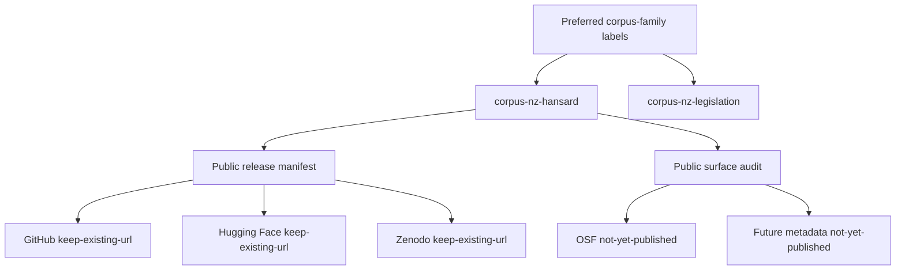
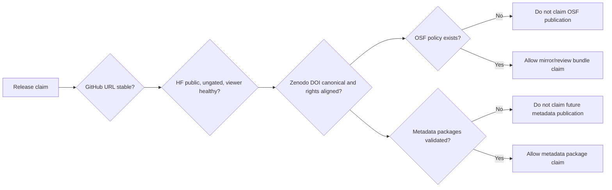

# Corpus Family Naming And Publication Alignment

This document is the human-readable companion to `manifests/corpus_family_publication_alignment.json`.

## Naming Standard

The preferred systematic labels for this corpus family are:

- `corpus-nz-hansard` for the New Zealand Hansard corpus.
- `corpus-nz-legislation` for the New Zealand legislation sibling corpus.

Existing public Hansard URLs and DOI records remain stable. The alignment policy is to add systematic labels, sibling links, and release-readiness gates without renaming established GitHub, Hugging Face, or Zenodo surfaces in place.

## Publication Environments

| Environment | Current public surface | Alignment decision | Release gate |
| --- | --- | --- | --- |
| GitHub | `https://github.com/edithatogo/corpus-nz-hansard` | `keep-existing-url` | Repository, release, license, Actions, branch-protection/security posture, README, and sibling-link evidence remain current. |
| Hugging Face | `https://huggingface.co/datasets/edithatogo/nz-hansard-corpus` | `keep-existing-url` | Dataset remains public and ungated, card keeps explicit `configs`, and viewer health is checked before release claims. |
| Zenodo | `https://zenodo.org/records/20595194` | `keep-existing-url` | Canonical DOI, related identifiers, version chain, files, source-rights caveats, and metadata remain aligned. |
| OSF | None claimed | `not-yet-published` | No OSF mirror or review bundle is claimed until file-size, splitting, checksum, citation, and update-cadence policy exists. |
| Future metadata | None claimed | `not-yet-published` | Croissant, RO-Crate, Frictionless, DCAT, PROV-O, and related metadata packages validate before external publication claims. |

## Alignment Flow



## Environment Gates



## DOI Update Rules

Dataset card DOI references, `CITATION.cff`, `RELEASE_NOTES.md`, and release manifests must continue to point to `10.5281/zenodo.20595194` unless a separate migration track approves a replacement. Superseded review records remain historical evidence only. Sibling-corpus labels may be added to documentation and metadata, but published Hansard URLs and DOI records must not be renamed without a migration plan.

## Validation

Validate the alignment ledger with:

```powershell
python scripts/check_corpus_family_alignment.py
```

The validator checks the schema, required family labels, environment IDs, non-migration decisions, agreement with `manifests/public_dataset_release_manifest.json`, agreement with `manifests/public_surface_audit.json`, and required documentation/evidence terms.
