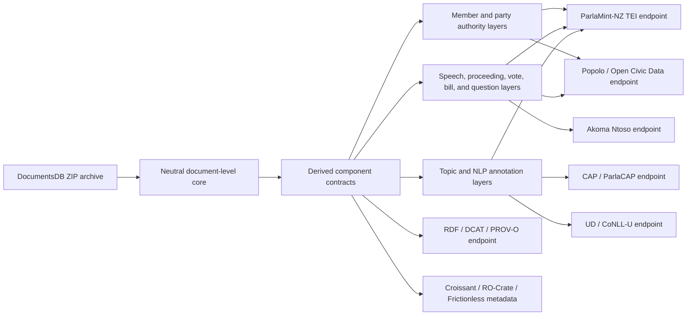

# Parliamentary Corpus Interoperability Design

## Design Principle

The repository should expose a neutral parliamentary corpus core and generate standard-specific endpoints from that core. This keeps the project useful for ParlaMint-NZ while also serving civic technology, legal informatics, topic-agenda, RDF, and NLP users.

## Neutral Core

The neutral core is the existing document-level Hansard record contract plus future derived component tables. It uses repository-owned stable identifiers and provenance fields. It does not embed ParlaMint, Popolo, Akoma Ntoso, CAP, or Universal Dependencies assumptions as primary data requirements.

Core entities:

- source archive
- source member file
- source row
- document
- sitting
- proceeding item
- speech turn
- member
- party
- role or office
- question
- motion
- vote event
- bill or legislative item
- topic code
- linguistic annotation
- derived assertion
- authority source
- gold/evaluation sample
- release series
- stable URI

## Endpoint Families

| Endpoint | Primary users | Generated from | Status |
| --- | --- | --- | --- |
| ParlaMint-NZ / TEI | corpus linguistics, comparative parliamentary research | document, sitting, speech turn, member, party, linguistic annotation | target |
| Parla-CLARIN samples | TEI schema and corpus maintainers | ParlaMint-NZ sample package | target |
| Popolo / Open Civic Data | civic technology, voting records, member history | member, party, role, motion, vote event, speech turn | target |
| Akoma Ntoso | legal informatics, legislative-document workflows | document, proceeding item, bill, motion, vote, question | target |
| CAP / ParlaCAP | agenda-setting and policy-topic research | speech turn, document, topic code | target |
| Universal Dependencies / CoNLL-U | NLP researchers | validated sentence/token annotations | target |
| RDF linked data | semantic-web users | neutral component tables plus provenance | target |
| Croissant / RO-Crate / Frictionless | ML, archival, and tabular-data users | release metadata and component descriptors | target |
| Hugging Face / Parquet | dataset consumers and ML users | neutral and validated derived tables | existing and target |

## Data Flow

## Release Ladder

Endpoint publication should follow this ladder:

1. Document-level release: source-faithful normalized records only.
2. Authority-source release: versioned official source inventories and hashes.
3. Neutral component release: validated member, party, sitting, proceeding, speech, vote, bill, topic, or annotation components.
4. Endpoint release: generated ParlaMint-NZ, Popolo/Open Civic Data, Akoma Ntoso, CAP/ParlaCAP, UD/CoNLL-U, RDF, or metadata packages.
5. Upstream contribution package: validated samples, mapping notes, known exclusions, and submission evidence for external maintainers.

Each ladder step must keep source-archive completeness, historical completeness, validation status, and authority-source coverage separate.

## Validation Gates

Every endpoint must declare:

- input artifacts
- output files
- schema or ontology version
- validation command
- validation manifest
- known exclusions
- publication target
- upstream contribution target, if any

Endpoint artifacts may be published only when their validation manifest records zero blocking errors or the release notes explicitly mark them as exploratory/non-authoritative.

## Upstream Contribution Targets

- ParlaMint-NZ: generate ParlaMint-compatible TEI, local validation evidence, and representative samples before opening a contribution path with ParlaMint maintainers.
- Parla-CLARIN: contribute schema examples, encoding notes, or validation edge cases only after ParlaMint-NZ sample generation.
- mySociety/parlparse and PublicWhip-style outputs: use as civic-data design references and contribute parser improvements or reusable NZ fixtures only if maintainers accept cross-jurisdiction contributions.
- Comparative Agendas Project and ParlaCAP: publish CAP-coded NZ outputs and prepare mapping notes; upstream submission depends on the maintainers' current intake process.
- Open Civic Data and Popolo ecosystems: produce compatible JSON/RDF outputs and feed back schema issues if NZ parliamentary practice exposes gaps.

## SOTA Metadata And Annotation Targets

- Croissant metadata for ML-ready dataset discovery.
- RO-Crate metadata for research-object packaging and archival context.
- Frictionless Data Package descriptors for tabular endpoint resources.
- W3C Web Annotation selectors for source spans, offsets, and annotation targets.
- NIF/RDF linguistic annotation views only after RDF and UD/CoNLL-U validation mature.
- W3C Time for temporal parliamentary memberships, offices, sittings, and periods.
- OntoLex-Lemon only for a later terminology or lexicon layer.

## Recommended Libraries

| Use | Libraries |
| --- | --- |
| Core tabular processing | `pandas`, `pyarrow`, `duckdb` |
| High-volume transforms | `polars` where memory or speed pressure justifies it |
| Schema validation | `jsonschema`, `pydantic`, `pandera` |
| XML and TEI/Akoma Ntoso | `lxml`, `xmlschema`; external `jing` where Relax NG validation is required |
| RDF and linked data | `rdflib`, `pyshacl`, `linkml` |
| Name matching | `rapidfuzz` |
| NLP pipelines | `spacy`, `stanza`, `conllu`, `pyconll` |
| ML classification and embeddings | `transformers`, `sentence-transformers`, `scikit-learn` |
| Topic modelling | `bertopic` for exploratory analysis only |
| Metadata packaging | `frictionless`, `rocrate`, `mlcroissant` |
| Testing | `unittest` in the existing suite, with fixtures for each endpoint contract |

Generic NLP libraries should support extraction and quality review, not replace authority-source validation for members, parties, votes, or official parliamentary structure.

Heavy endpoint libraries should be optional dependency groups rather than base requirements.
